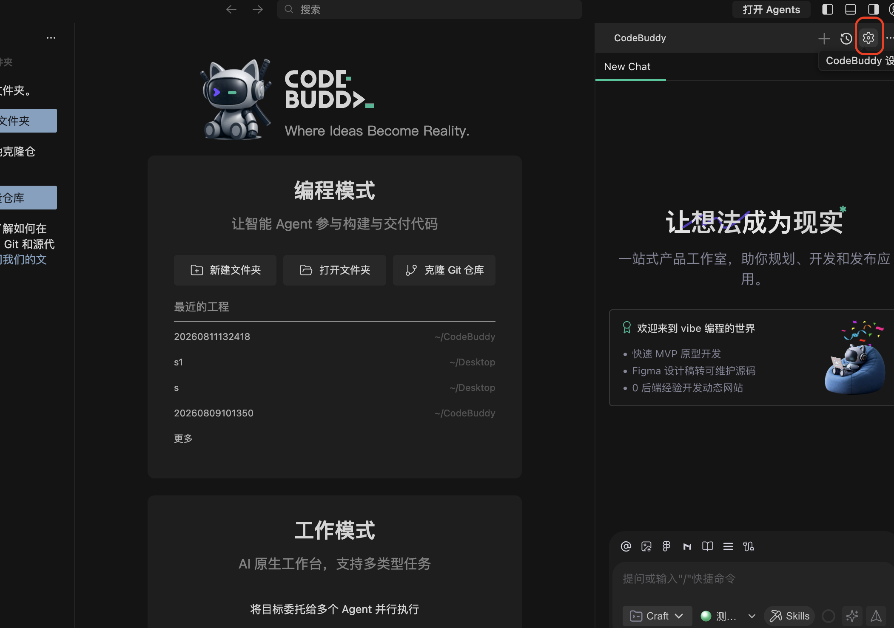
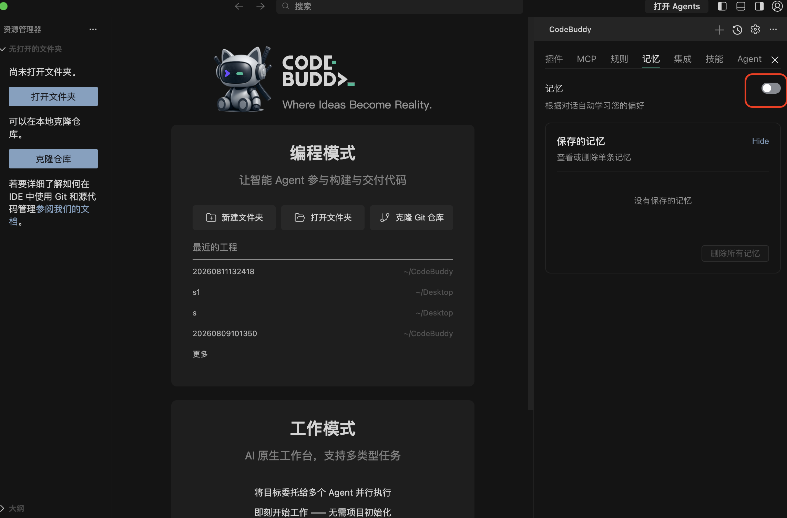
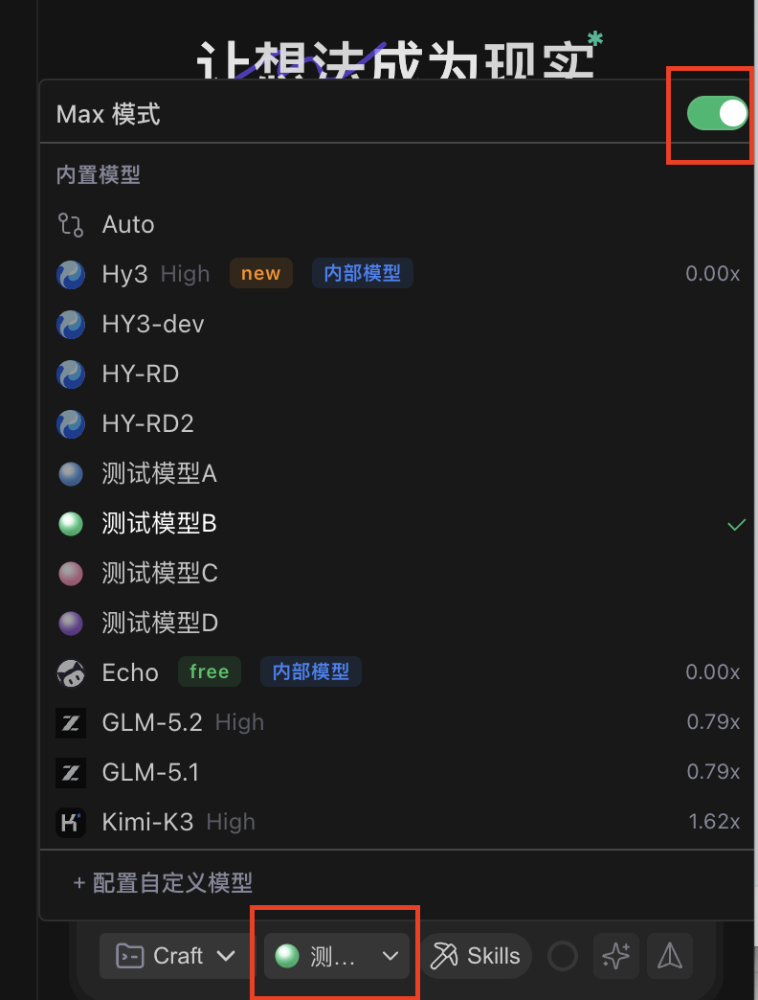
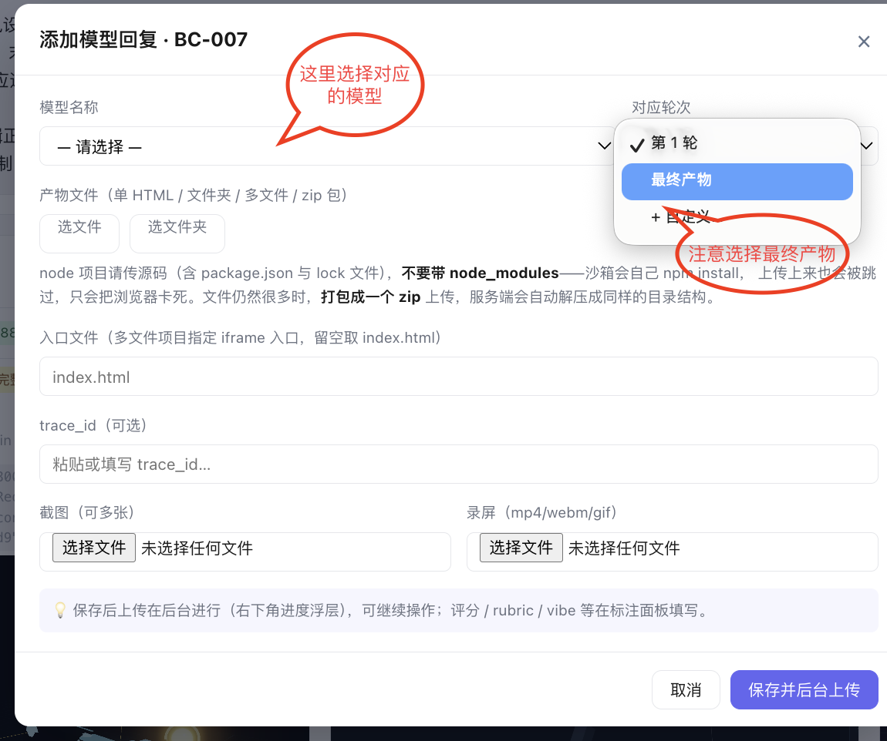
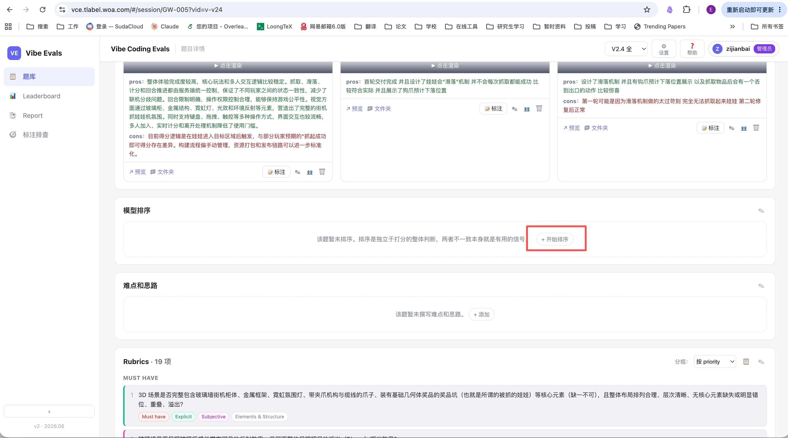
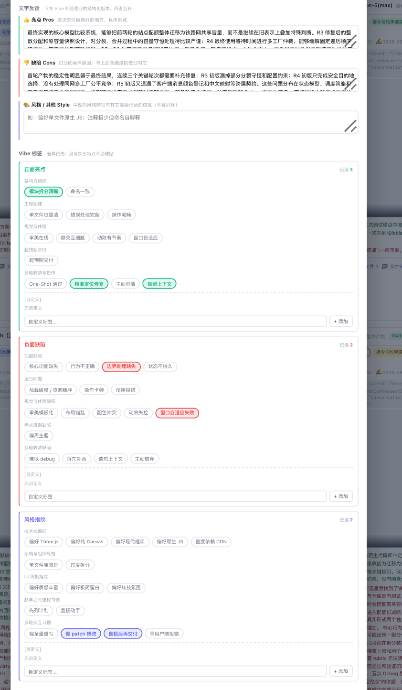

> 来源：`Coding Agent 人评标准 V 2.1.docx`（本目录内原始文档，未作任何修改）。本文件为完整全文转换，未做摘要或删减；章节号按 Word 自动编号的实际渲染结果补齐（如「二、打分流程指南」「三、多模型Rank」在原始文档里是自动编号）。转换脚本见 `tools/docx_to_markdown.py`。

# Coding Agent 人评标准 V 2.1

默认脚手架：CodeBuddy

## 一、平台操作指南

@xiaovhou(侯小钰)

### 1.1 codebuddy

1. 下载codebuddy，确认自己能看到测试模型系列、HY-RD系列模型

2. 关闭codebuddy memory设置

3. 提前为每一个题目，每一个模型先新建好电脑本地的项目文件夹，命名为“sessionID-任务名题目摘要”：

    a. 各产物文件夹命名为“sessionID-任务名题目摘要-模型X”；

    b. 每次评测模型的时候打开对应的文件夹“sessionID-任务名题目摘要-模型X”，保证当前工作目录的干净

    c. 保留最终产物上传到平台，如果是多轮题目的话，标注清楚最后停在第几轮，“sessionID-任务名题目摘要-模型X-第X轮”

4. 评测环境管理

    a. 电脑性能较好的同学用容器隔离任务评测环境管理

    b. 如果直接在本地环境跑，为了防止模型读取当前文件夹外的文件，造成先后测试的结果不可比，需要直接在提示词里边说明：不准读取当前文件夹外的文件。

5. 开始执行评测

    a. 输入本次评测任务的prompt；

    b. **选择本次需要测的模型，开启Max模式开关**

### 1.2 标注平台

1. 标注平台网址

    a. 公司内：

    b. https://vce.tlabel.woa.com

    c. 供应商：Vibe Coding Evals--人评系统

2. 在顶部选择“V3.0”版本

3. 在搜索框中输入对应的session_id，找到对应的题目

4. 上传产物

    a. 点击“添加模型回复”

    b. 选择“最终产物”

    c. 如果产物文件数量过多，打包成zip进行上传

## 二、打分流程指南

在平台上传所有模型的产物后，工作流如下：1）上传所有模型产物；2）对所有模型产物进行总体排序+给每个模型打总体印象分如果是和旧产物比的话，就重新打开看下旧产物，然后一起排序给出排序理由和洞察先排序再打总体印象分，总体印象分的排序应该和总体排序是严格一致的。但是：总体印象分和pointwise的均分不必严格一致。3）对每个模型产物的每个维度打分（用扣分和加分的思维进行打分），同时：在文字反馈里说明打分依据，3分是达到验收标准，高于/低于3分在每个维度说明扣分和加分依据，例如给了1.5分，【任务完成度】扩展点找对了，但最终交付仍不完整：既有测试因配置兼容报错，新测试数据不全、分裂守恒测试未真实断线；分裂后运力未合理分到子网；配置字段未贯通对局链路，多轮 Debug 后仍未验收通过。给了0.5分，【任务收敛效率】能围绕原结构连续打补丁，但根因定位和验证闭环弱；测试兼容、真实断线、配置生效同一批问题反复出现，五次 Debug 仍未收敛。【其他】https://vce.tlabel.woa.com/#/session/FE-022?vid=v-v24目前是写在pros和cons里边4）对每个模型的产物打上Vibe Tags标签，并进行其他补充Vibe Tags标签不必须，只选择该模型最突出的点pros，cons，stylistic fingerprints补充Vibe Tags标签覆盖不到的点然后按照如下格式下：【其他】……5）更新洞察在给所有模型进行详细打分后，如果有新的见解更新一下洞察，关注一下两个点：最大模型差异：哪个环节真正拉开差距；能力边界Insight：当前AI在这类任务上已经能做什么、哪些还需要人纠正才能做对。关于debug：多轮debug次数上限是3次，单轮加功能是5次，单轮修bug题目是3轮。多轮题目如果3轮debug后达不到3分（即可用标准，就算模型失败在这一轮）debug规范：只给错误描述（+期望达到的现象，这个可以不写，但是错误信息描述一定要写），不能跟模型说如何修改

每个模型回复（response）的标注由 1个总体印象分 + pointwise多维度打分 + Vibe Tags +1 个备注（分为三块）四个部分 组成：

| ***维度*** | ***内容*** | ***量纲*** |
| --- | --- | --- |
| **总体印象分** | 总体印象分 | *0-4 分，允许0.5分档打分* |
| ***Pointwise*** | 通用基础三维度 + domain专属维度评分 | *每维度 0-4 分，允许0.5分档打分* |
| **Vibe Tags** | **三维度选择共性标签** | **pros，cons，stylistic fingerprints分别预设了一些标签，如果你发现这个模型有很强烈的共性，但标签里面没有体现，可提交“自由标签”** |
| ***标注备注*** | 三个自由文本框（最重要） | **pros，cons，stylistic fingerprints的三个文本框，请不要写和标签一样的简洁内容** **维度打分依据也写在pros，cons中** |

注意：rank并不是根据pointwise的绝对分排序，一定是根据你的体感进行排序，请认真对比多个模型的表现。

## 三、多模型Rank

*Rank 用于同一道题下多个模型回复之间的相对比较。它回答的是“如果只能选一个交付，优先选谁”，而不是“谁的各维平均分更高”。完成所有模型评分后，再基于实际产物做一次独立的整体判断。*

核心原则：先独立形成整体判断，再用分数做一致性检查。总体印象分和rank是严格一致的，但是和各维度均分不必严格一致，但如果趋势与均分不符合请再次检查。

### 3.1 操作流程

1.上传所有模型产物，然后给各个产物打总体印象分。

2. 进入排序：在题目详情页找到“模型排序”，点击“+ 开始排序”。

    a. 根据排序比较看总体印象分是否需要修改

*图 4-1 “从题目详情页进入“模型排序”*

3.分配档位：这里是排序，而不是分数，注意不要弄反。1 代表最好，数字越大顺位越后；同一档位号表示并列。每个可评模型都应有档位。

*图 2 排序 Modal：同档位号表示并列，1 为最好*

4. 检查排序表达式：系统会生成 A > B = C > D 形式的结果。核对上下顺序、并列关系和遗漏项；必要时用上下箭头微调。

5. 补充文字并保存：填写“排序理由”；如发现跨模型共性问题，再写“洞察”，最后点击“保存排序”。

6. *后续每个模型的产物标注完后可以调整总体印象分和排序，但pointwise各个维度的均分不必和怕苦严格一致，这里的排序和总体印象分更加关注的是体感和第一印象。*

### 3.2 排序判断原则

先看能否交付，再看质量高低。优先判断真正改变选择结论的差异：

- 硬失败优先：无法运行 / 编译、核心链路阻断、严重违背显性约束，通常应明显靠后；局部亮点不能抵消阻断性交付问题。

- 看整体交付：综合指令遵循、功能完整性、结果质量、工程质量、鲁棒性与验证情况，不要只盯某一张图或某一段代码。

- 看人工修复成本：同样“能跑”时，优先选择关键缺陷更少、边界更稳、无需大面积返工的产物。

- 只抓关键分水岭：通常写清 1-3 个真正拉开差距的事实即可，不要用大量轻微问题堆出名次。

- 并列规则：只有在交换两者位置也不改变推荐、且没有稳定证据拉开差距时才并列。不要为了省事把“差不多”全部并列，也不要为了凑完整名次强行制造差距。

### 3.3 排序理由怎么写

*排序理由写的是“分水岭”，不是把 A > B > C 换成一句话。建议 1-3 句，覆盖相邻档位的关键差异；有并列时，说明为什么现有证据不足以拉开。只写可观察事实，不写模型名气或个人偏好。*

*图 3 “排序理由”用于记录可复核的差异证据*

例题：使用纯 SVG 代码绘制一个等距视角（Isometric）的微型城市。包含道路、建筑、公园、树木、车辆和行人。要求整体构图完整，具有立体感和统一风格。不要使用任何 HTML、CSS、JavaScript 或外部资源，只输出完整 SVG 代码文件。

好的理由：“A 的道路、建筑、公园、树木、车辆和行人都齐，等距方向也统一；B 漏了行人，右侧建筑的透视方向还反了；C 画面最丰富，但在 SVG 里引用了外部图片，违反了硬约束。因此 A > B > C。”

***差的理由：“A 效果最好，B 其次，C 最差。”（只是复述名次，没有说差异）***

### 3.4 洞察怎么写

**主要写两个维度：**

***●最大模型差异：哪个环节真正拉开差距；***

***●能力边界Insight：当前AI在这类任务上已经能做什么、哪些还需要人纠正才能做对。***

好的洞察：“多数模型能画出立体建筑，但道路、车辆和行人的朝向没有跟着同一套等距轴线走；这题的共性问题不是缺元素，而是透视没统一。”

差的洞察：“A 的视觉最好，C 漏了行人。”

**后续给每个模型打完各个维度的分数后，接着修改洞察，补充一些新的见解。**

## 四、Pointwise 多维度评分

Pointwise 评分采用 “通用基础维度 + 场景专属维度” 的模式：

- 通用基础维度适用于所有一/二级分类

- 场景专属维度根据二级分类增减

特别注意！！！各个维度介绍：“指令与约束遵循”评估是否有“照做需求”，漏了一些要求没实现在这里扣分。多轮题目对前文要求的遗忘也是这个维度“功能交付完整性”衡量了模型该轮产出的结果在已有的功能上是否有bug，bug程度有多大（目前只评最终轮，所以看最终产物）“任务收敛效率”考虑多轮整体debug的效果（多少轮能debug，有没有引入新问题等），是对整个session的过程表现评分不考虑模型调用资源失败导致的原因，主要关注debug效率“视觉审美”是带前端页面（包括全栈、多端开发）的页面美观度打分，包括物体建模、颜色、动效等等。需要和功能剥离看待，功能好，画面可能粗糙，反之亦然。“需求理解与澄清”，仅适用于模糊需求型，需要模型先定方向的题，主要关注模型首轮的提问质量。目前没有后端题，暂不考虑架构合理性。最重要的事情：用扣分和加分思维进行打分，可用的标准是3分，如果达到验收标准就是3分，如果超过预期就加分，如果低于预期就扣分不要情绪化打分，不要debug几轮之后就全部给0分，给0分一定要谨慎。不是3分的都要给出扣分和加分依据在cons和pros里说清楚给了1.5分，【任务完成度】扩展点找对了，但最终交付仍不完整：既有测试因配置兼容报错，新测试数据不全、分裂守恒测试未真实断线；分裂后运力未合理分到子网；配置字段未贯通对局链路，多轮 Debug 后仍未验收通过。给了0.5分，【任务收敛效率】能围绕原结构连续打补丁，但根因定位和验证闭环弱；测试兼容、真实断线、配置生效同一批问题反复出现，五次 Debug 仍未收敛。可以参照：https://vce.tlabel.woa.com/#/session/FE-022?vid=v-v24

| ***评估维度*** | ***评估重点和定义*** | ***是否可N/A*** | ***0分 (完全不可用)*** | ***1分 (严重不足)*** | ***2分 （可用但有瑕疵)*** | ***3分 (达到验收要求)*** | ***4分 (高质量且有亮点)*** |
| --- | --- | --- | --- | --- | --- | --- | --- |
| ***指令与约束遵循*** | *是否准确落实显性指令、硬性限制和复杂组合约束，不擅自改变任务目标。* | *通用维度，不可选N/A* | *完全无视核心指令或硬性约束，自作主张（如选错语言/框架），结果南辕北辙。* | *仅遵循极少部分宏观指令，丢失大量关键约束（如命名规范、API、格式完全失控），需大规模重构。* | *核心约束基本执行到位，但次要规则有明显违背（如忽略文件结构、混用库），需人工排查修正。* | *严格遵守所有显性的指令和硬性约束，代码格式规范，不越界、不漏项，表现符合预期。* | *100%遵守所有约束，在极端复杂的复合指令下展现极强控制力；能主动避开未写明但潜在的冲突点。* |
| ***功能交付完整性*** | 关键功能、核心链路是否正常实现，没有bug | *通用维度，不可选N/A* | *代码存在严重语法错误，无法编译或运行；前端白屏报错；核心功能一项都未实现。* | *勉强能跑，但主干链路断裂/存在阻断性Bug；仅实现极少部分核心需求，完全无法投入使用。* | *主业务跑通，核心功能可用，但存在非关键Bug或缺乏边界条件处理（如遇空数据崩溃），必须人工修补。* | *核心流程完全闭环，运行流畅无明显Bug，边界处理得当。交付的是可直接运行的完整成品。* | *功能完美运行无Bug，且在鲁棒性、性能优化或扩展性上有突出表现（如防抖节流、容错机制），体验超预期。* |
| ***任务收敛效率*** | *在任务目标和当前阶段要求已经明确后，模型能否通过实现、验证和修正，使任务高效、稳定地达到可验收状态。重点观察首轮实现基础、每轮有效进展、根因定位、重复犯错、修改范围、回归和最终收敛；轮次仅作参考。* | *通用维度，不可选N/A* | 上限为5轮的：5轮无法修复 上限为3轮的（单轮修bug题目+多轮题）：3轮依然无法交付，如果是多轮题，就算每个轮次的平均debug轮次 | 上限为5轮的：3-4轮无法修复 上限为3轮的（单轮修bug题目+多轮题）：2轮依然无法交付，如果是多轮题，就算每个轮次的平均debug轮次 | 上限为5轮的：2-3轮无法修复 上限为3轮的（单轮修bug题目+多轮题）：1轮依然无法交付，如果是多轮题，就算每个轮次的平均debug轮次 | *上限为5轮的：首轮已形成正确主体，后续只需少量针对性修正，只需要1轮debug* 上限为3轮的（单轮修bug题目+多轮题）1轮能够交付，如果是多轮题，就算每个轮次的平均debug轮次 | *不需要debug，首轮即形成高质量实现，或遇到问题时能够主动验证、快速定位根因，并以最小必要改动完成修复；整个过程几乎没有无效尝试、重复错误和功能回归，以很低的人工协作成本达到高质量验收。* |
| ***视觉审美*** | *前端界面的布局、层级、配色、风格一致性，以及与参考图或主题的匹配程度。* | *前端维度，不适用时可选N/A* | *页面错乱或样式基本失效，无法正常阅读和使用。* | *有基础框架，但布局、层级、配色或比例存在严重问题。* | *核心元素存在，整体可用，但视觉粗糙、模板化或与目标有明显偏差。* | *排版规整、层级清晰、风格协调，达到正常产品或现代 UI 的预期。* | *在满足功能和题目风格要求的基础上，视觉设计、细节和交互明显优于普通交付，且不过度装饰。* |
| ***架构合理性*** | *模块职责、代码边界、接口与数据契约是否清晰，修改和扩展成本是否可控。* | *后端维度，不适用时可选N/A* | *逻辑混杂、职责不分，结构无法维护，需要推翻重写。* | *形式上有文件或分层，但边界严重混乱、重复代码多，修改影响面失控。* | *基本结构存在，但部分职责越界、契约不一致或扩展成本较高。* | *分层和模块边界清楚，职责、接口和数据契约合理，修改范围可控。* | *在不过度设计的前提下，为真实可预见的扩展、错误处理、事务或兼容性提供清晰机制。* |
| ***需求理解与澄清*** | *在开始实施前，模型能否准确理解用户真实意图，识别影响方案和验收结果的关键歧义，并通过必要提问、明确假设或提供选项，使需求达到可执行状态。* | *模糊需求维度，不适用时可选N/A* | *完全无识别能力。对模糊需求装作清楚，硬猜实现；产物与用户真实意图严重偏离；不主动提任何澄清问题。* | *有"可能没理解"的意识但不行动。仅写一两句"如果不对请告诉我"敷衍式备注，仍按错误假设硬干；澄清问题缺失或问的是无关紧要的格式细节。* | *能问问题但不到位。能识别到 1-2 个明显的模糊点并提问，但漏掉关键决策点（业务边界、数据口径、性能要求）；问题颗粒度过粗或过细，未能帮助用户聚焦。* | *澄清问题准确且必要。能在第 1 轮主动提出 2-4 个真正影响实现的关键问题（覆盖业务边界、技术选型、数据范围等）；对自行假设的部分明确标注"我假设了 X，如不对请告知"。* | *澄清+决策建议。除提问外，给出每个选项的权衡与推荐方案；能识别隐性需求并主动验证（"通常这类场景还需要 Y，是否需要？"），让用户在最少轮次内完成需求收敛。* |

## 五、Vibe Tags 与备注（人评最重要的环节 ⭐）

在平台上是pros+cons+stylistic fingerprints  三个部分Vibe 标注就是用来记录这种"感受差异"的，是后续做模型特性聚合分析、训练偏好回流、产品决策的核心信号源。需要写的东西包括1）文字反馈里给出上文多维度打分的依据，比如cons里写：给了1.5分，【任务完成度】扩展点找对了，但最终交付仍不完整：既有测试因配置兼容报错，新测试数据不全、分裂守恒测试未真实断线；分裂后运力未合理分到子网；配置字段未贯通对局链路，多轮 Debug 后仍未验收通过。给了0.5分，【任务收敛效率】能围绕原结构连续打补丁，但根因定位和验证闭环弱；测试兼容、真实断线、配置生效同一批问题反复出现，五次 Debug 仍未收敛。2）vibe标签选择从标签中选择该模型最突出的特点，没有不必硬写3）文字反馈中补充其他信息不包含在vibe标签和pointwise中的信息比如在风格中写：习惯调用子agent,喜欢用 emoji 写 commit message

在平台上进行操作

### vibe tags表格

总表格如下：

| ***类型*** | ***分类*** | ***具体tag*** | ***定义*** | ***判定信号*** |
| --- | --- | --- | --- | --- |
| *Pros* | *架构与组织* | *模块拆分清晰* | *多文件项目里能感受到职责划分明显，不是大杂烩* | *看产物文件树 / 模块名是否自解释* |
| *Pros* | *架构与组织* | *命名一致* | *全程同一种命名风格，不混用 camelCase / snake_case* | 文件、变量等可见的取名 |
| *Pros* | 工程纪律 | *单文件也整洁* | *单 HTML / 单文件交付里，函数/类切分得当* | *浏览器 view-source 大致扫一眼粒度（限单文件题）* |
| *Pros* | *工程纪律* | *错误处理完备* | *边界 case（空输入、网络失败、非法值）都做了 friendly 处理* | *故意输入空值、超长字符、断网模拟看反馈是否友好* |
| *Pros* | *工程纪律* | *操作流畅* | *大量数据 / 复杂动画 / 频繁交互下肉眼无明显卡顿、掉帧* | *实际拖拽、点击、输入若干次，凭手感判断；不强制开 DevTools Performance* |
| *Pros* | *视觉与体验* | *审美在线* | *配色、间距、字体、留白形成统一风格，主题贴合度也算在内* | *整体看 30 秒就能感受到设计感；如题目写明主题（赛博朋克 / 工业风 / 节日主题），看 UI 是否真的呼应* |
| *Pros* | *视觉与体验* | *微交互细腻* | *按压反馈、hover 状态、loading 占位都做了* | *鼠标过元素 / 点按钮 / 等异步看到细节* |
| *Pros* | *视觉与体验* | *动效有节奏* | *动画时长、缓动、触发时机恰到好处* | *触发若干动画看是否自然不生硬* |
| *Pros* | *视觉与体验* | *窗口自适应* | *不同屏幕尺寸下都不破相* | *浏览器拉窗口 / 切换设备模拟器，至少看 375 / 768 / 1920 三档* |
| *Pros* | *超预期交付* | *超预期交付* | *实现了 prompt 没明说、但显著提升体验的功能或细节，包括：识别隐性需求、识别 DP（设坑点）、补充常识级附加功能（撤销 / 复制 / 快捷键   / README 等）、做出 rubric 之外让人"哇"的点* | *操作完产物后能可数地说出"它多做了哪几件好事"；与其他模型对比有可见差异* |
| *Pros* | *多轮收敛与协作* | *One-Shot 通过* | *第 1 轮就完整交付，不需要任何修正* | *直接看是否首轮就 OK* |
| *Pros* | *多轮收敛与协作* | *精准定位修复* | *多轮 debug 时能直接找到根因，最小改动修复* | *看每一轮的修改范围* |
| *Pros* | *多轮收敛与协作* | *主动澄清* | *模糊需求型题目里主动提出关键澄清问题* | *看模型在第 1 轮是否反问而不是硬猜* |
| *Pros* | *多轮收敛与协作* | *保留上下文* | *多轮交互时记得之前的约定（命名、技术栈、风格）* | *多轮后看代码风格是否一致* |
| *Cons* | *功能缺陷* | *核心功能缺失* | *关键功能直接没做* | *对照 prompt 显性要求逐条核* |
| *Cons* | *功能缺陷* | *行为不正确* | *功能在但行为不对（拖拽失灵、计算错误、状态不同步、点了无响应等）* | *实际操作复现* |
| *Cons* | *功能缺陷* | *边界处理缺失* | *空输入 / 极值 / 异常输入直接崩或行为离谱* | *故意输入畸形数据* |
| *Cons* | *功能缺陷* | *状态不持久* | *刷新 / 切换 tab 后状态丢失（prompt 暗示需要持久化时）* | *刷一次页面看* |
| *Cons* | *运行问题* | *加载缓慢 / 资源臃肿* | *页面初次加载明显慢，或反复加载相同资源* | *肉眼判断"打开太久才出内容"；可选开 Network 看请求数 / 总 size* |
| *Cons* | *运行问题* | *操作卡顿* | *普通操作（拖拽、点击、滚动）下肉眼可感知的卡顿 / 掉帧* | *实际操作若干次凭手感判断；不强制开 DevTools Performance* |
| *Cons* | *运行问题* | *使用报错* | *使用过程中 Console 持续刷红字，或 alert / 错误弹窗反复弹出* | *打开 Console 一眼可见，或操作时频繁被错误提示打断* |
| *Cons* | *视觉与体验缺陷* | *审美模板化* | *直接用 Bootstrap / Tailwind 默认配色或常见模板皮，无品牌感、无主题贴合* | *看一眼就有"这就是套个模板"的感觉* |
| *Cons* | *视觉与体验缺陷* | *布局错乱* | *元素重叠、溢出窗口、文字截断* | *标准 1920×1080 屏幕一眼可见* |
| *Cons* | *视觉与体验缺陷* | *配色冲突* | *色彩搭配生硬，前景背景对比不足* | *关键文字读不清楚* |
| *Cons* | *视觉与体验缺陷* | *动效失控* | *动画过度 / 卡顿 / 在错误时机触发* | *观察至少一次完整交互* |
| *Cons* | *视觉与体验缺陷* | *窗口自适应失败* | *拉窗口或切换设备尺寸后排版炸* | *试 375px / 768px / 1920px 三档* |
| *Cons* | *需求遵循缺陷* | *偏离主题* | *整体方向跑偏，做了别的东西 / 违反硬性限制 / 不顾 prompt 自己加一堆没要求的东西* | *看产物 30 秒就能识别；对照 prompt 看是否大方向一致* |
| *Cons* | *多轮收敛缺陷* | *难以 debug* | *多轮调试中无法定向修复问题，指出问题后模型反复改不对、反复给错误方案* | *看是否在 5 轮上限内仍未解决同一个 bug* |
| *Cons* | *多轮收敛缺陷* | *拆东补西* | *修一个 bug 换出另一个 bug* | *多轮对比看* |
| *Cons* | *多轮收敛缺陷* | *遗忘上下文* | *后面轮次忘了前面定的约定（命名、技术栈、风格）* | *看是否在多轮间漂移* |
| *Cons* | *多轮收敛缺陷* | *主动放弃* | *直接说"这个我做不到"或胡乱给个 placeholder* | *看是否中途交差* |
| *Stylistic Fingerprints* | *技术栈偏好* | *偏好 Three.js* | *3D 题倾向用 Three.js 而非纯 Canvas* | *复杂 3D：正面；简单 2D 也用：负面（杀鸡用牛刀）* |
| *Stylistic Fingerprints* | *技术栈偏好* | *偏好纯 Canvas* | *即使有 Three.js 选项也用 Canvas 实现 3D* | *轻量游戏：正面；复杂 3D：负面* |
| *Stylistic Fingerprints* | *技术栈偏好* | *偏好现代框架* | *不指定技术栈时默认套 React / Vue / Svelte 等现代框架 + Tailwind / UnoCSS 等* | *现代化场景：正面；轻量交付：负面* |
| *Stylistic Fingerprints* | *技术栈偏好* | *偏好原生 JS* | *不引入框架直接写 vanilla（含纯 HTML / CSS / JS）* | *单文件交付：正面；复杂应用：负面* |
| *Stylistic Fingerprints* | *技术栈偏好* | *重度依赖 CDN* | *一上来就引 jQuery / Bootstrap / Three.js CDN* | *演示：正面；离线场景：负面* |
| *Stylistic Fingerprints* | *架构与组织风格* | *单文件原教旨* | *不管多复杂都塞一个 HTML 里* | *单文件交付：正面；中大型：负面* |
| *Stylistic Fingerprints* | *架构与组织风格* | *过度拆分* | *简单需求拆成 N 个文件 N 层目录* | *大项目：正面；MVP：负面* |
| *Stylistic Fingerprints* | *UI 风格指纹* | *偏好质感丰富* | *大量阴影 / 浮起卡片 / 毛玻璃 / 渐变层叠等"有材质感"的视觉处理（涵盖原 Material Design /   Glassmorphism）* | *后台系统 / 仪表盘：正面；轻量工具 / 文字密集页：负面* |
| *Stylistic Fingerprints* | *UI 风格指纹* | *偏好极简留白* | *大量留白 + 单一强调色 + 细字重 + 极少装饰元素（涵盖原 Apple HIG / 极简主义）* | *内容展示 / 高端工具：正面；游戏 / 3D 仿真 / 复杂应用：负面* |
| *Stylistic Fingerprints* | *UI 风格指纹* | *偏好炫技氛围* | *偏爱霓虹色 / glow 阴影 / 大渐变 / 粒子动效等"视觉冲击"型处理（涵盖原 霓虹/赛博偏好）* | *游戏 / cyber 主题：正面；专业工具 / 严肃场景：负面* |
| *Stylistic Fingerprints* | *起手式与流程习惯* | *先列计划* | *第 1 轮先输出 plan / 拆 step，再写代码* | *复杂题：正面；简单题：啰嗦* |
| *Stylistic Fingerprints* | *起手式与流程习惯* | *直接动手* | *拿到 prompt 直接写代码不寒暄* | *简单题：正面；复杂题：可能漏需求* |
| *Stylistic Fingerprints* | *多轮交互习惯* | *偏全量重写* | *每次修改重写整个文件* | *小文件：正面；大文件：低效* |
| *Stylistic Fingerprints* | *多轮交互习惯* | *偏 patch 修改* | *每次只给 diff / patch* | *大文件：正面；改动大：晦涩* |
| *Stylistic Fingerprints* | *多轮交互习惯* | *自检后再交付* | *写完后自己描述测试过程* | *复杂题：正面；简单题：啰嗦* |
| *Stylistic Fingerprints* | *多轮交互习惯* | *等用户喂报错* | *不主动跑代码，等用户贴报错才修* | *谨慎风格：可接受；高效场景：负面* |

## 六、检查

每道题要进行如下检查：

1. 排序和总体印象分是否有差异

2. ponitwise各维度的打分是否合理，是否在cons和pros里说清楚打分依据，是否情绪化打分

    a. 如果和总体印象分趋势完全不符合，主要原因是什么？是否在cons和pros里说清楚理由

3. 给出这个题目的洞察：模型在这个题上的共性和差异点，模型的能力边界 

## 8. FAQ @jayyjlin(jayyjlin)

| ***问题*** | ***解答*** |
| --- | --- |
| *我打开产物白屏了，怎么标 Vibe？* | *Cons 贴 静态 UI 实现 或 偏离主题，备注写"白屏，Console 报 XX 错"。其他维度可暂跳过* |
| *多个模型都用了 Three.js，要不要都贴"偏好 Three.js"？* | *不贴。指纹的意思是"该模型相对独特的偏好"，所有人都用就不是指纹* |
| *Pros 和 Cons 同时贴 主题贴合 和 霓虹色应付，矛盾吗？* | *不矛盾。可以是"整体主题贴合，但具体配色用霓虹色应付"——但请在备注里说清楚* |
| *我看不出技术栈偏好怎么办？* | *不贴。风格指纹本来就是"特别明显时才贴"，看不出说明该模型在这维度无突出风格* |
| *自由备注必填吗？* | *强烈建议填。即使所有标签都为空，备注里写一句"中规中矩"也比完全空白有用* |
| *我想标的现象在标签库里没有怎么办？* | *用 [自定义] 创建，标注完后告诉运营整理，下个版本可能纳入预设* |
| *同一个产物 Vibe 标完 30 分钟后怎么改？* | *重新打开标注 modal，覆盖保存即可。Vibe 没有版本历史* |
| *Vibe 备注会用来训练模型吗？* | *会。所以请用工程师视角写真实感受，不要带情绪 / 玩梗 / 敷衍* |
| *风格指纹和 Cons 标签有时候很像（如"重度依赖 CDN" vs “依赖泛滥”），怎么选？* | *看场景：该题 prompt 没禁止外部依赖 → 指纹；prompt 明确要求"不引外部依赖"或在敏感场景 → Cons* |

*Last updated: 2026.08 · 反馈联系 jay*
